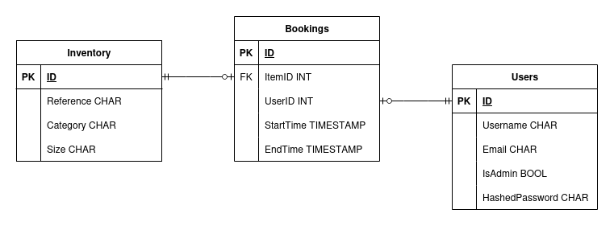

# fastapi-club-inventory
Inventory/booking backend CRUD app with FastAPI for a sports club, e.g. a canoe club.

One of my main hobbies is kayaking, and the clubs I am in sometimes discuss setting up a more formalised booking and inventory management system to keep track of where the kit has gone. This is a prototype backend for such an application.

## Data model
The data model looks something like this slightly sloppy ERD:

This corresponds to three SQLModel/SQLAlchemy tables, unsurprisingly named 'Inventory', 'Bookings', and 'Users'.

## Stack

* **FastAPI** - main framework
* **SQLModel** - ORM
* **PostgresQL** - storage layer
* **Docker Compose** - database/application co-deployment

## Security
User authentication is done through OAuth2 with bearer tokens. See API docs.

## Deployment

**1. Set the following environment variables** (e.g. in `.env`):

For database storage:
- `POSTGRES_USER`
- `POSTGRES_PASSWORD`
- `POSTGRES_URI`

Note that the app isn't actually hardcoded to use PostgresQL, e.g. testing uses SQLite. 

For access tokens/login:
- `SECRET_KEY` - for token validation (generate with RSA)
- `ALGORITHM` - which encryption algorithm to use
- `ACCESS_TOKEN_EXPIRE_MINUTES` - validity time for access token

And last but not least:
- `BACKEND_URI` (e.g. http://localhost:8000/)

**2. Run with Docker compose**:
``docker compose up -d --build``

The app should now be running. Docs will be at `${BACKEND_URI}/docs`.

## Tests

## Improvements/extensions
Some ideas:
* Monitoring and observability with Prometheus
* Finer-grained RBAC, e.g. 'clubhouse-manager', 'committee-member, 'volunteer' roles
* External auth - Google/Github etc 
* Keycloak user management (tried but disproportionate effort)
* User interface e.g. with Reflex

For larger app:
* Async app - not necessary for any scale this backend will be used for